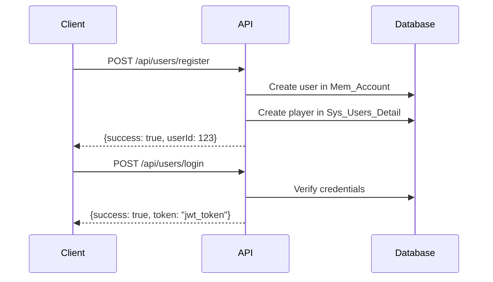
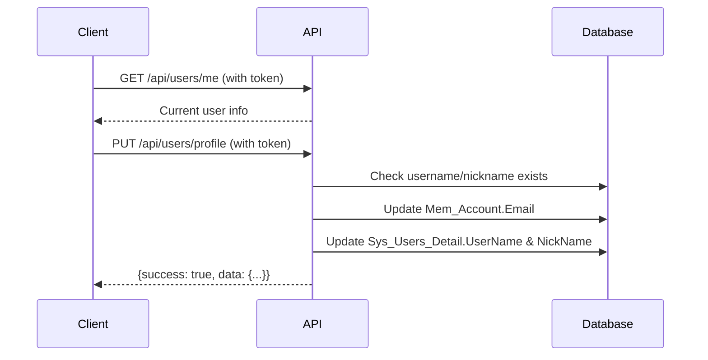
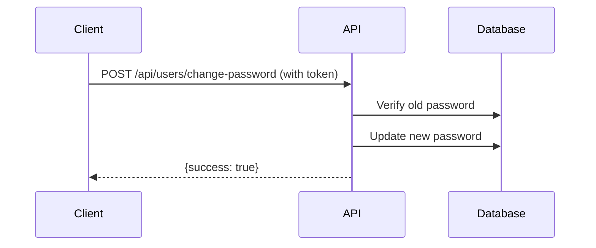

# API Documentation - GunnyApi

## Base URL
```
https://your-domain.com/api
```

## Authentication
Hầu hết các endpoint yêu cầu authentication bằng JWT Bearer Token.

```http
Authorization: Bearer {your_jwt_token}
```

---

## 📝 Table of Contents
- [Authentication APIs](#authentication-apis)
  - [Register](#1-register)
  - [Login](#2-login)
- [User Profile APIs](#user-profile-apis)
  - [Get Current User Info](#3-get-current-user-info)
  - [Update Profile](#4-update-profile)
  - [Change Password](#5-change-password)

---

## Authentication APIs

### 1. Register
Đăng ký tài khoản mới.

**Endpoint:** `POST /api/users/register`

**Authentication:** ❌ Not Required

#### Request Body:
```json
{
  "username": "user@example.com",
  "password": "yourPassword123",
  "nickname": "PlayerName",
  "sex": true
}
```

#### Request Fields:
| Field | Type | Required | Description |
|-------|------|----------|-------------|
| username | string | ✅ | Email của người dùng |
| password | string | ✅ | Mật khẩu (tối thiểu 6 ký tự) |
| nickname | string | ✅ | Nickname trong game (3-20 ký tự) |
| sex | boolean | ✅ | Giới tính (true: Nam, false: Nữ) |

#### Success Response (200 OK):
```json
{
  "success": true,
  "userId": 12345,
  "message": "Đăng ký tài khoản thành công"
}
```

#### Error Responses:

**Username đã tồn tại (400 Bad Request):**
```json
{
  "success": false,
  "message": "Email đã tồn tại hoặc có lỗi khi tạo tài khoản"
}
```

**Thiếu thông tin (400 Bad Request):**
```json
{
  "success": false,
  "message": "Username không được rỗng"
}
```

---

### 2. Login
Đăng nhập vào hệ thống.

**Endpoint:** `POST /api/users/login`

**Authentication:** ❌ Not Required

#### Request Body:
```json
{
  "applicationName": "DanDanTang",
  "userName": "user@example.com",
  "password": "yourPassword123"
}
```

#### Request Fields:
| Field | Type | Required | Default | Description |
|-------|------|----------|---------|-------------|
| applicationName | string | ❌ | "DanDanTang" | Tên ứng dụng |
| userName | string | ✅ | - | Email đăng nhập |
| password | string | ✅ | - | Mật khẩu |

#### Success Response (200 OK):
```json
{
  "success": true,
  "userId": 12345,
  "token": "eyJhbGciOiJIUzI1NiIsInR5cCI6IkpXVCJ9...",
  "refreshToken": "refresh_token_here",
  "message": "Đăng nhập thành công"
}
```

#### Response Fields:
| Field | Type | Description |
|-------|------|-------------|
| success | boolean | Trạng thái đăng nhập |
| userId | integer | ID của user |
| token | string | JWT Access Token (dùng để authenticate các request khác) |
| refreshToken | string | Refresh Token (dùng để lấy token mới) |
| message | string | Thông báo |

#### Error Responses:

**Sai thông tin đăng nhập (401 Unauthorized):**
```json
{
  "success": false,
  "message": "Tên đăng nhập hoặc mật khẩu không đúng"
}
```

**Thiếu thông tin (401 Unauthorized):**
```json
{
  "success": false,
  "message": "Username không được rỗng"
}
```

---

## User Profile APIs

### 3. Get Current User Info
Lấy thông tin user hiện tại từ token.

**Endpoint:** `GET /api/users/me`

**Authentication:** ✅ Required

#### Request Headers:
```http
Authorization: Bearer {your_jwt_token}
```

#### Success Response (200 OK):
```json
{
  "id": 12345,
  "username": "user@example.com",
  "email": "user@example.com",
  "nickname": "PlayerName",
  "money": 10000,
  "createdAt": "2026-01-25T10:30:00",
  "isActive": true
}
```

#### Response Fields:
| Field | Type | Description |
|-------|------|-------------|
| id | integer | User ID |
| username | string | Email/Username |
| email | string | Email của user |
| nickname | string | Nickname trong game (từ Sys_Users_Detail) |
| money | integer | Số tiền hiện có |
| createdAt | datetime | Ngày tạo tài khoản |
| isActive | boolean | Trạng thái active |

#### Error Responses:

**Chưa đăng nhập (401 Unauthorized):**
```json
{
  "message": "Không tìm thấy thông tin user từ token"
}
```

**User không tồn tại (404 Not Found):**
```json
{
  "message": "Không tìm thấy user"
}
```

---

### 4. Update Profile
Cập nhật username (email) và/hoặc nickname.

**Endpoint:** `PUT /api/users/profile`

**Authentication:** ✅ Required

#### Request Headers:
```http
Authorization: Bearer {your_jwt_token}
Content-Type: application/json
```

#### Request Body:
```json
{
  "username": "newemail@example.com",
  "nickname": "NewNickname"
}
```

#### Request Fields:
| Field | Type | Required | Validation |
|-------|------|----------|------------|
| username | string | ✅ | Email format, 5-100 ký tự |
| nickname | string | ✅ | 3-20 ký tự, chỉ chữ cái, số, space, _, - |

> **⚠️ Lưu ý quan trọng:**  
> Client **KHÔNG** cần gửi username/nickname cũ lên. API sẽ **tự động lấy thông tin hiện tại từ database** dựa trên `userId` trong JWT token, sau đó so sánh với giá trị mới để quyết định có cập nhật hay không.  
> - Username hiện tại được lấy từ `Mem_Account.Email`
> - Nickname hiện tại được lấy từ `Sys_Users_Detail.NickName` (query bằng username)

#### Validation Rules:

**Username:**
- Phải đúng định dạng email
- Độ dài: 5-100 ký tự
- Không được trùng với username khác trong hệ thống

**Nickname:**
- Độ dài: 3-20 ký tự
- Chỉ được chứa: chữ cái, số, khoảng trắng, gạch dưới (_), gạch ngang (-)
- Không được chứa ký tự đặc biệt như: @, #, $, %, &, *, etc.
- Không được trùng với nickname khác trong hệ thống

#### Success Response (200 OK):
```json
{
  "success": true,
  "message": "Cập nhật thông tin thành công",
  "data": {
    "username": "newemail@example.com",
    "nickname": "NewNickname"
  }
}
```

#### Error Responses:

**Username đã tồn tại (400 Bad Request):**
```json
{
  "success": false,
  "message": "Username 'email@example.com' đã tồn tại"
}
```

**Nickname đã tồn tại (400 Bad Request):**
```json
{
  "success": false,
  "message": "Nickname 'ExistingNickname' đã tồn tại"
}
```

**Email không đúng định dạng (400 Bad Request):**
```json
{
  "success": false,
  "message": "Email không đúng định dạng"
}
```

**Độ dài không hợp lệ (400 Bad Request):**
```json
{
  "success": false,
  "message": "Nickname phải có độ dài từ 3-20 ký tự"
}
```

**Ký tự không hợp lệ (400 Bad Request):**
```json
{
  "success": false,
  "message": "Nickname chỉ được chứa chữ cái, số, khoảng trắng, gạch dưới và gạch ngang"
}
```

**Không có thay đổi (400 Bad Request):**
```json
{
  "success": false,
  "message": "Không có thay đổi nào được phát hiện"
}
```

**Chưa đăng nhập (401 Unauthorized):**
```json
{
  "message": "Không tìm thấy thông tin user từ token"
}
```

#### Cách hoạt động:
1. **Lấy thông tin hiện tại từ DB:**
   - API sử dụng `userId` từ JWT token để query `Mem_Account` → lấy username hiện tại (Email)
   - Dùng username hiện tại để query `Sys_Users_Detail` → lấy nickname hiện tại

2. **So sánh thay đổi:**
   - So sánh `username` trong request với username hiện tại từ DB
   - So sánh `nickname` trong request với nickname hiện tại từ DB
   - Nếu không có thay đổi → trả về lỗi "Không có thay đổi nào được phát hiện"

3. **Validate:**
   - Kiểm tra format email, độ dài, ký tự hợp lệ
   - Kiểm tra username/nickname mới có trùng với user khác không (loại trừ user hiện tại)

4. **Update vào DB:**
   - **Username thay đổi**: Update `Mem_Account.Email` + `Sys_Users_Detail.UserName`
   - **Nickname thay đổi**: Update `Sys_Users_Detail.NickName`

#### Lưu ý:
- Client chỉ cần gửi giá trị **mới** muốn cập nhật, API tự động lấy giá trị cũ từ DB để so sánh
- API tự động phát hiện những trường nào thay đổi và chỉ update những trường đó
- Nếu cả username và nickname đều không thay đổi → API trả về lỗi
- Username sẽ được update trong cả `Mem_Account.Email` và `Sys_Users_Detail.UserName`
- Nickname chỉ update trong `Sys_Users_Detail.NickName`
- Sau khi đổi username, nên đăng nhập lại để lấy token mới với thông tin cập nhật

---

### 5. Change Password
Đổi mật khẩu cho user đã đăng nhập.

**Endpoint:** `POST /api/users/change-password`

**Authentication:** ✅ Required

#### Request Headers:
```http
Authorization: Bearer {your_jwt_token}
Content-Type: application/json
```

#### Request Body:
```json
{
  "oldPassword": "currentPassword123",
  "newPassword": "newPassword456",
  "confirmPassword": "newPassword456"
}
```

#### Request Fields:
| Field | Type | Required | Description |
|-------|------|----------|-------------|
| oldPassword | string | ✅ | Mật khẩu hiện tại |
| newPassword | string | ✅ | Mật khẩu mới |
| confirmPassword | string | ✅ | Xác nhận mật khẩu mới |

#### Validation Rules:
- Tất cả các trường đều bắt buộc
- `newPassword` và `confirmPassword` phải giống nhau
- `newPassword` không được trùng với `oldPassword`
- `oldPassword` phải đúng với mật khẩu hiện tại

#### Success Response (200 OK):
```json
{
  "success": true,
  "message": "Đổi mật khẩu thành công"
}
```

#### Error Responses:

**Mật khẩu cũ không đúng (400 Bad Request):**
```json
{
  "success": false,
  "message": "Mật khẩu cũ không đúng"
}
```

**Mật khẩu mới không khớp (400 Bad Request):**
```json
{
  "success": false,
  "message": "Mật khẩu mới và xác nhận mật khẩu không khớp"
}
```

**Mật khẩu mới trùng mật khẩu cũ (400 Bad Request):**
```json
{
  "success": false,
  "message": "Mật khẩu mới không được trùng với mật khẩu cũ"
}
```

**Thiếu trường bắt buộc (400 Bad Request):**
```json
{
  "success": false,
  "message": "Mật khẩu cũ không được rỗng"
}
```

**Chưa đăng nhập (401 Unauthorized):**
```json
{
  "message": "Không tìm thấy thông tin user từ token"
}
```

---

## 🔒 Security Features

### 1. JWT Authentication
- Access Token có thời gian sống giới hạn
- Refresh Token để lấy token mới
- Token được mã hóa và signed

### 2. Password Encryption
- Hỗ trợ cả MD5 và BCrypt
- Password không bao giờ được trả về trong response

### 3. SQL Injection Protection
- Tất cả input đều được validate và sanitize
- Sử dụng parameterized queries

### 4. Input Validation
- Email format validation
- Length validation
- Special character filtering
- Unique constraint checking

---

## 🌐 Internationalization (i18n)

API hỗ trợ đa ngôn ngữ (Tiếng Việt và English). Ngôn ngữ mặc định là Tiếng Việt.

Để thay đổi ngôn ngữ, bạn có thể config trong server settings hoặc gửi header:
```http
Accept-Language: en
```

### Supported Languages:
- `vi` - Tiếng Việt (default)
- `en` - English

---

## 📊 HTTP Status Codes

| Code | Description |
|------|-------------|
| 200 | Success - Request thành công |
| 400 | Bad Request - Dữ liệu không hợp lệ |
| 401 | Unauthorized - Chưa đăng nhập hoặc token không hợp lệ |
| 404 | Not Found - Không tìm thấy resource |
| 500 | Internal Server Error - Lỗi server |

---

## 🔄 API Flow Examples

### Flow 1: Đăng ký và Đăng nhập



### Flow 2: Cập nhật Profile



### Flow 3: Đổi mật khẩu



---

## 💡 Code Examples

### JavaScript/TypeScript (Fetch API)

#### Register:
```javascript
const register = async (username, password, nickname, sex) => {
  const response = await fetch('https://your-domain.com/api/users/register', {
    method: 'POST',
    headers: {
      'Content-Type': 'application/json',
    },
    body: JSON.stringify({
      username,
      password,
      nickname,
      sex
    })
  });
  
  return await response.json();
};
```

#### Login:
```javascript
const login = async (userName, password) => {
  const response = await fetch('https://your-domain.com/api/users/login', {
    method: 'POST',
    headers: {
      'Content-Type': 'application/json',
    },
    body: JSON.stringify({
      userName,
      password
    })
  });
  
  const data = await response.json();
  
  if (data.success) {
    // Lưu token vào localStorage hoặc sessionStorage
    localStorage.setItem('access_token', data.token);
    localStorage.setItem('refresh_token', data.refreshToken);
  }
  
  return data;
};
```

#### Get Current User:
```javascript
const getCurrentUser = async () => {
  const token = localStorage.getItem('access_token');
  
  const response = await fetch('https://your-domain.com/api/users/me', {
    method: 'GET',
    headers: {
      'Authorization': `Bearer ${token}`,
    }
  });
  
  return await response.json();
};
```

#### Update Profile:
```javascript
const updateProfile = async (username, nickname) => {
  const token = localStorage.getItem('access_token');
  
  const response = await fetch('https://your-domain.com/api/users/profile', {
    method: 'PUT',
    headers: {
      'Authorization': `Bearer ${token}`,
      'Content-Type': 'application/json',
    },
    body: JSON.stringify({
      username,
      nickname
    })
  });
  
  return await response.json();
};
```

#### Change Password:
```javascript
const changePassword = async (oldPassword, newPassword, confirmPassword) => {
  const token = localStorage.getItem('access_token');
  
  const response = await fetch('https://your-domain.com/api/users/change-password', {
    method: 'POST',
    headers: {
      'Authorization': `Bearer ${token}`,
      'Content-Type': 'application/json',
    },
    body: JSON.stringify({
      oldPassword,
      newPassword,
      confirmPassword
    })
  });
  
  return await response.json();
};
```

### C# (.NET)

#### Register:
```csharp
using System.Net.Http;
using System.Text;
using System.Text.Json;

public class ApiClient
{
    private readonly HttpClient _httpClient;
    
    public ApiClient(string baseUrl)
    {
        _httpClient = new HttpClient { BaseAddress = new Uri(baseUrl) };
    }
    
    public async Task<RegisterResponse> RegisterAsync(string username, string password, string nickname, bool sex)
    {
        var request = new
        {
            username,
            password,
            nickname,
            sex
        };
        
        var content = new StringContent(
            JsonSerializer.Serialize(request),
            Encoding.UTF8,
            "application/json"
        );
        
        var response = await _httpClient.PostAsync("/api/users/register", content);
        var responseBody = await response.Content.ReadAsStringAsync();
        
        return JsonSerializer.Deserialize<RegisterResponse>(responseBody);
    }
}
```

#### Login and Store Token:
```csharp
public async Task<LoginResponse> LoginAsync(string userName, string password)
{
    var request = new
    {
        userName,
        password
    };
    
    var content = new StringContent(
        JsonSerializer.Serialize(request),
        Encoding.UTF8,
        "application/json"
    );
    
    var response = await _httpClient.PostAsync("/api/users/login", content);
    var responseBody = await response.Content.ReadAsStringAsync();
    var result = JsonSerializer.Deserialize<LoginResponse>(responseBody);
    
    if (result.Success)
    {
        // Store token for future requests
        _httpClient.DefaultRequestHeaders.Authorization = 
            new System.Net.Http.Headers.AuthenticationHeaderValue("Bearer", result.Token);
    }
    
    return result;
}
```

#### Update Profile:
```csharp
public async Task<UpdateProfileResponse> UpdateProfileAsync(string username, string nickname)
{
    var request = new
    {
        username,
        nickname
    };
    
    var content = new StringContent(
        JsonSerializer.Serialize(request),
        Encoding.UTF8,
        "application/json"
    );
    
    var response = await _httpClient.PutAsync("/api/users/profile", content);
    var responseBody = await response.Content.ReadAsStringAsync();
    
    return JsonSerializer.Deserialize<UpdateProfileResponse>(responseBody);
}
```

### Python

#### Using requests library:
```python
import requests

BASE_URL = "https://your-domain.com/api"

# Register
def register(username, password, nickname, sex):
    url = f"{BASE_URL}/users/register"
    data = {
        "username": username,
        "password": password,
        "nickname": nickname,
        "sex": sex
    }
    response = requests.post(url, json=data)
    return response.json()

# Login
def login(user_name, password):
    url = f"{BASE_URL}/users/login"
    data = {
        "userName": user_name,
        "password": password
    }
    response = requests.post(url, json=data)
    result = response.json()
    
    if result.get('success'):
        # Store token
        return result.get('token')
    return None

# Get Current User
def get_current_user(token):
    url = f"{BASE_URL}/users/me"
    headers = {
        "Authorization": f"Bearer {token}"
    }
    response = requests.get(url, headers=headers)
    return response.json()

# Update Profile
def update_profile(token, username, nickname):
    url = f"{BASE_URL}/users/profile"
    headers = {
        "Authorization": f"Bearer {token}",
        "Content-Type": "application/json"
    }
    data = {
        "username": username,
        "nickname": nickname
    }
    response = requests.put(url, headers=headers, json=data)
    return response.json()

# Change Password
def change_password(token, old_password, new_password, confirm_password):
    url = f"{BASE_URL}/users/change-password"
    headers = {
        "Authorization": f"Bearer {token}",
        "Content-Type": "application/json"
    }
    data = {
        "oldPassword": old_password,
        "newPassword": new_password,
        "confirmPassword": confirm_password
    }
    response = requests.post(url, headers=headers, json=data)
    return response.json()
```

---

## ❓ FAQ

### 1. Token hết hạn sau bao lâu?
Token có thời gian sống mặc định theo cấu hình server. Khi token hết hạn, client cần sử dụng refresh token để lấy token mới hoặc đăng nhập lại.

### 2. Có thể thay đổi username thành một email khác không?
Có, nhưng email mới phải chưa tồn tại trong hệ thống và đúng định dạng email.

### 3. Nickname có phân biệt chữ hoa chữ thường không?
Có, nickname phân biệt chữ hoa chữ thường khi kiểm tra trùng lặp.

### 4. Có giới hạn số lần đổi mật khẩu không?
Không có giới hạn, nhưng cần biết mật khẩu cũ để đổi.

### 5. Làm sao để logout?
Client chỉ cần xóa token khỏi storage (localStorage/sessionStorage). Server-side không cần xử lý logout.

---

## 📞 Support

Nếu có vấn đề hoặc câu hỏi, vui lòng liên hệ:
- Email: support@example.com
- Documentation: https://docs.your-domain.com

---

**Last Updated:** January 25, 2026  
**API Version:** 1.0.0
